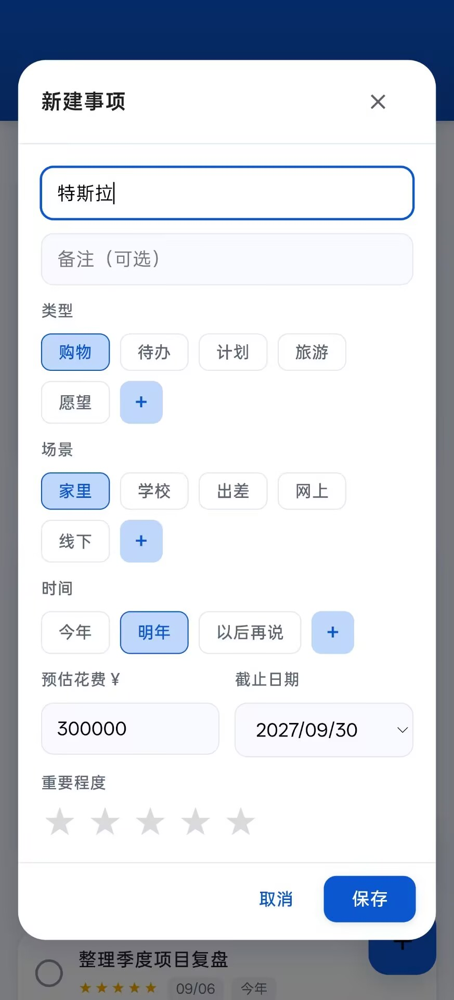
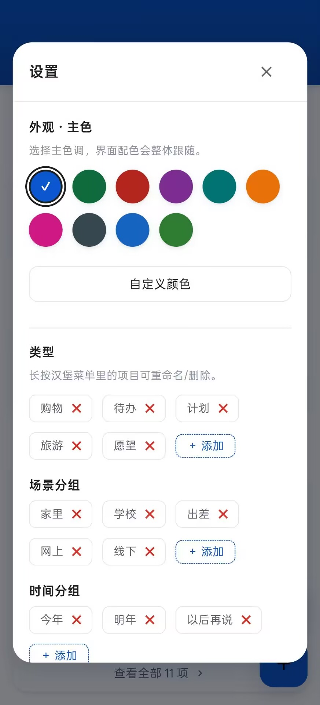

<div align="center">

# SuperTodo · 超级清单

一款轻量、优雅且丝滑的现代化多维度待办与清单管理应用。  
支持三层架构分类、拖拽调序、AI 智能速记与整理，提供纯前端静态体验与原生 Android APK 封装。

[](https://github.com/PaidaxingTuT/SuperTodo/releases)
[](#)
[](#)
[](LICENSE)

<br/>


</div>

---

## 核心特性

- **三层清晰架构**：类型（购物 / 待办 / 计划 / 旅游 / 愿望等）→ 场景/时间分组 → 事项清单，告别杂乱无章。
- **原生桌面小部件**：
  - 提供 4×2 与 4×4 两种常用规格，桌面可直接点击打勾标记完成。
  - 支持按场景/时间筛选分组与自定义排序，支持待办金额价格显示，自适应系统日夜模式。
- **自定义列表间距与字号**：内置「紧凑 / 标准 / 宽松」快捷预设，并支持自由调节卡片间距、内边距与字号大小，灵活适应不同屏幕尺寸。
- **AI 智能增强**：
  - **一句话速记**：自然语言输入即可自动提取分类、截止日期、预估花费与重要程度。
  - **智能归类整理**：一键为未分类或待整理事项建议场景与标签，逐条预览采纳。
- **丝滑拖拽排序**：集成 Sortable.js，在默认排序下随时长按/按住把手拖拽调整优先级，动画流畅，落位即存。
- **高度个性化**：内置 10 款精致预设主题配色方案，并支持自定义调色板，全界面实时跟随。
- **日夜间模式**：界面默认跟随系统深浅色，也可在侧栏中手动切换。
- **本地安全与数据备份**：所有数据均保存在本地 `localStorage`，支持完整的 JSON 格式数据导出与导入备份。

---

## 功能预览

| **软件首页** | **AI 速记** | **添加事项** | **软件设置** |
| :---: | :---: | :---: | :---: |
|  |  |  |  |

---

## 技术栈

- **前端核心**：纯原生 HTML5 / CSS3（CSS Variables + Modern Flexbox/Grid）/ Vanilla JavaScript（ES6+），无任何重型前端框架依赖。
- **拖拽交互**：[Sortable.js](https://github.com/SortableJS/Sortable)
- **原生封装**：Capacitor（Android WebView 原生能力与下载支持）
- **AI 接口**：标准 OpenAI 兼容接口（可在设置中自定义 Base URL / API Key / Model）
- **自动化构建**：GitHub Actions（自动化打包 Android APK、固定签名校验并发布 Release）

---

## 快速开始

本项目为纯原生前端架构，本地调试无需配置复杂的 Node.js 或构建工具环境。

### 1. 获取代码

```bash
git clone https://github.com/PaidaxingTuT/SuperTodo.git
cd SuperTodo
```

### 2. 运行与体验

- **方式一（直接打开）**：双击根目录下的 `index.html`，即可在浏览器中体验全部功能。
- **方式二（本地静态服务器，推荐）**：
  ```bash
  # 使用 Python 启动本地 HTTP 服务
  python -m http.server 8000
  ```
  在浏览器中访问 `http://localhost:8000` 即可。

### 3. Android APK 安装

前往 [Releases 页面](https://github.com/PaidaxingTuT/SuperTodo/releases) 下载最新版本的 `SuperTodo-X.Y.Z.apk` 安装包即可。

---

## 项目结构

```plaintext
SuperTodo/
├── .github/workflows/    # GitHub Actions 自动化构建与发布流程
├── android-src/          # Android 原生桌面小部件源码、布局与资源
├── app-icon.png          # 应用图标原图
├── app-icon-dark.png     # 夜间模式应用图标
├── app-icon-foreground.png # 夜间自适应前景与启动页纯透明小标
├── app.js                # 核心业务逻辑、状态管理与本地持久化
├── CHANGELOG.md          # 版本更新历史记录
├── debug.keystore        # Android 固定签名证书
├── index.html            # 页面 DOM 结构与弹窗模板
├── screenshots/          # 应用演示截图与效果图
│   ├── add.jpg           # 添加事项
│   ├── ai.jpg            # AI 一句话速记
│   ├── home.jpg          # 软件首页
│   ├── settings.jpg      # 软件设置
│   └── title.png         # 项目顶部横幅
├── scripts/              # CI 自动化构建注入脚本
├── Sortable.min.js       # 拖拽排序核心依赖库
├── style.css             # 响应式布局、动画与主题配色样式
└── README.md             # 项目使用说明文档
```

---

## 贡献与反馈

欢迎提交 [Issue](https://github.com/PaidaxingTuT/SuperTodo/issues) 反馈 Bug 或提出功能建议！  
如果你觉得这个项目对你有帮助，欢迎点个 **Star** 支持一下。

---

## 开源许可

本项目基于 [MIT License](LICENSE) 开源协议。
