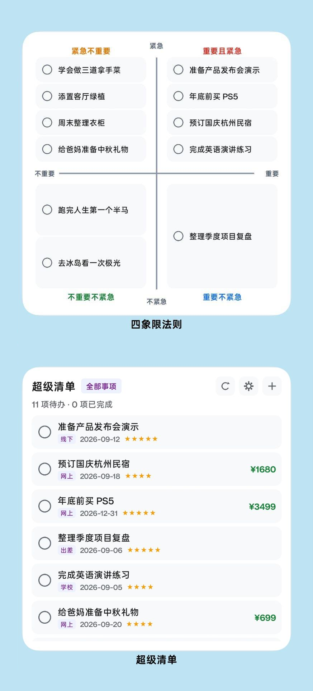
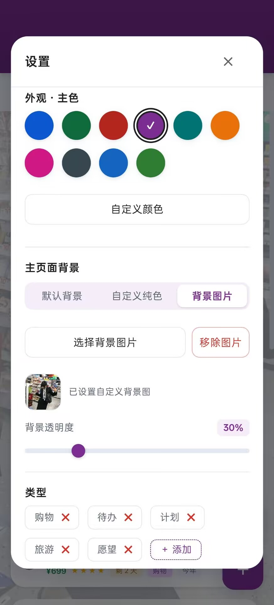

<div align="center">

# SuperTodo · 超级清单

一款轻量、优雅且丝滑的现代化多维度待办与清单管理应用。  
支持三层架构分类、拖拽调序、AI 智能速记与整理，提供纯前端静态体验与原生 Android APK 封装。

[](https://github.com/PaidaxingTuT/SuperTodo/releases)
[](#)
[](#)
[](LICENSE)

<br/>


</div>

---

- ## 核心特性

  - **三层任务架构与多维标签**
    - 采用「类型 → 场景/时间分组 → 事项」的三层结构组织任务。
    - 支持多类型、多场景关联，并可独立追踪各场景的完成状态。
  - **自然流畅的手势交互**
    - 支持左右滑动快速完成或删除事项。
    - 支持长按拖拽调整事项及分类顺序。
    - 核心操作配备触觉反馈，提升移动端操作体验。
  - **原生桌面小组件与悬浮窗**
    - 提供多种尺寸的桌面小组件，支持直接查看和完成事项。
    - 支持桌面快捷新建、事项筛选、排序等操作。
    - 支持毛玻璃桌面悬浮窗，无需进入应用即可快速管理任务。
    - 小组件与应用主题及系统深浅色模式保持联动。
  - **预算统计与智能提醒**
    - 根据事项预估花费自动统计总预算、待支出及已支出金额。
    - 智能识别逾期、今日截止、明日截止等时间状态。
    - 支持按照花费、重要程度、截止日期等维度进行排序。
  - **AI 智能增强**
    - 支持一句话速记，通过自然语言快速创建任务。
    - 自动提取分类、截止日期、预估花费和重要程度等信息。
    - 支持智能整理未分类事项，自动推荐合适的场景与时间标签。
  - **高度个性化**
    - 支持自定义背景、透明度、毛玻璃效果及列表布局。
    - 支持列表间距、内边距和字号等显示参数自由调整。
    - 提供多种主题配色，并支持自定义颜色。
    - 支持跟随系统或手动切换深浅色模式。
  - **本地数据与备份**
    - 数据本地存储，支持完整 JSON 格式导入与导出。
    - 支持通过系统文件管理器、微信、QQ 等应用直接打开备份文件并导入。
    - 支持系统分享及原生文件导出。
    - 提供回收站机制，支持恢复或彻底删除已移除事项。

---

## 功能预览

| **软件首页** | **AI 速记** | **原生组件** | **高度个性化** |
| :---: | :---: | :---: | :---: |
|  |  |  |  |

---

## 技术栈

- **前端**：HTML5、CSS3、Vanilla JavaScript（ES6+），采用原生 Web 技术构建，无重型前端框架依赖。
- **交互**：[Sortable.js](https://github.com/SortableJS/Sortable) —— 用于事项及分类的拖拽排序。
- **原生能力**：Capacitor —— 将 Web 应用封装为 Android App，并提供文件系统、分享等原生能力。
- **AI**：支持标准 OpenAI 兼容接口，可自定义 Base URL、API Key 和 Model。
- **自动化构建**：GitHub Actions —— 自动完成 Android APK 构建及 Release 发布。

------

## 快速开始

SuperTodo 采用纯原生 Web 技术构建，无需复杂的前端开发环境即可运行。

### 获取代码

```
git clone https://github.com/PaidaxingTuT/SuperTodo.git
cd SuperTodo
```

### 本地运行

**方式一：直接打开**

直接打开项目根目录下的 `index.html` 即可体验基础功能。

**方式二：使用本地静态服务器（推荐）**

```
python -m http.server 8000
```

然后访问：

```
http://localhost:8000
```

使用本地 HTTP 服务可以获得更稳定的浏览器运行环境。

### Android

前往 [Releases](https://github.com/PaidaxingTuT/SuperTodo/releases) 页面下载最新 Android APK。

------

## 项目结构

```
SuperTodo/
├── .github/workflows/     # GitHub Actions 自动化构建与发布
├── android-src/           # Android 原生能力、桌面小组件及相关资源
├── scripts/               # CI 自动化构建脚本
├── screenshots/           # 项目截图与展示素材
├── app.js                 # 核心业务逻辑、状态管理与数据持久化
├── index.html             # 页面结构与组件模板
├── widget_dialog.html     # 桌面悬浮窗界面
├── style.css              # 响应式布局、动画与主题样式
├── Sortable.min.js        # 拖拽排序依赖
├── CHANGELOG.md           # 版本更新记录
└── README.md              # 项目说明文档
```

------

## 贡献与反馈

欢迎通过 [Issues](https://github.com/PaidaxingTuT/SuperTodo/issues) 反馈 Bug、提出功能建议或分享使用体验。

如果 SuperTodo 对你有所帮助，欢迎点个 **Star** 支持项目。

------

## 开源许可

本项目基于 [MIT License](https://chatgpt.com/c/LICENSE) 开源。
